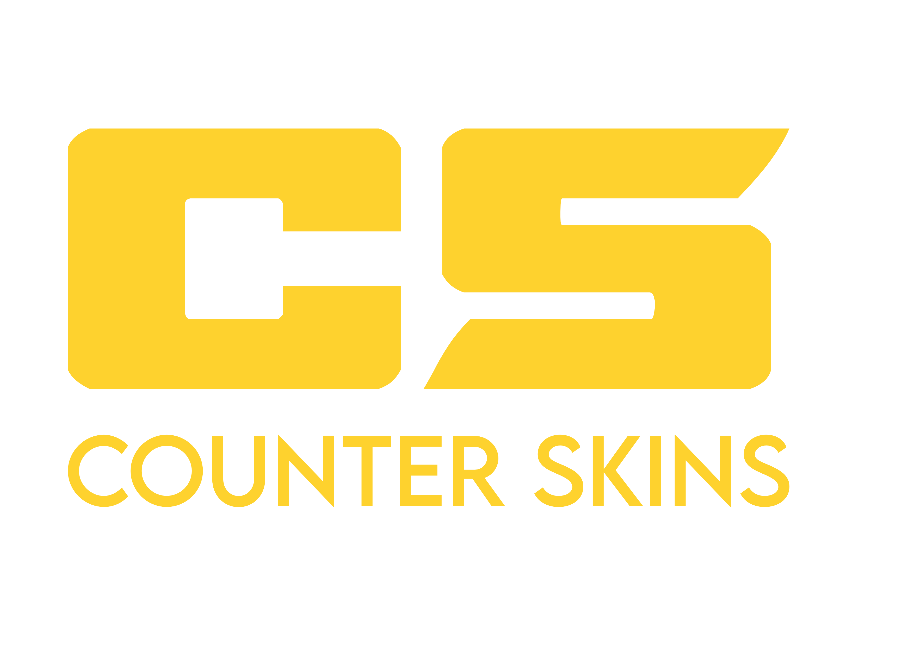

<!-- REPLACE ALL THE [USERNAME] TEXT WITH YOUR GITHUB PROFILE NAME & THE [PROJECTNAME] WITH THE NAME OF YOUR GITHUB PROJECT -->

<!-- Repository Information & Links-->
<br />


[![LinkedIn][linkedin-shield]][linkedin-url]
[![Instagram][instagram-shield]][instagram-url]
[![Behance][behance-shield]][behance-url]

<!-- HEADER SECTION -->
<h5 align="center" style="padding:0;margin:0;">Justin Koster</h5>
<h5 align="center" style="padding:0;margin:0;">200100</h5>
<h6 align="center">Interactive Development - 300</h6>
</br>
<p align="center">

  <a href="https://github.com/username/projectname">
    
  </a>
  
  <h3 align="center">Counter SKins</h3>

  <p align="center">
    Counter skins is a mobile application where enthusiasts of Counter Strike can go and enter a skins competition, users can enter and vote for other skins, the competitions are time based, once the time is up the winner of the competition will be declared, and who knows, maybe well see your skin in the next Counter Strike update ! <br>
      <a href="https://github.com/username/projectname"><strong>Explore the docs »</strong></a>
   <br />
   <br />
   <!-- <a href="path/to/demonstration/video">View Demo</a> -->
    ·
    <a href="https://github.com/username/projectname/issues">Report Bug</a>
    ·
    <a href="https://github.com/username/projectname/issues">Request Feature</a>
</p>
<!-- TABLE OF CONTENTS -->
## Table of Contents

* [About the Project](#about-the-project)
  * [Project Description](#project-description)
  * [Built With](#built-with)
* [Getting Started](#getting-started)
  * [Prerequisites](#prerequisites)
  * [How to install](#how-to-install)
* [Features and Functionality](#features-and-functionality)
* [Concept Process](#concept-process)
   * [Ideation](#ideation)
   * [Wireframes](#wireframes)
   * [User-flow](#user-flow)
* [Development Process](#development-process)
   * [Implementation Process](#implementation-process)
        * [Highlights](#highlights)
        * [Challenges](#challenges)
   * [Reviews and Testing](#peer-reviews)
        * [Feedback from Reviews](#feedback-from-reviews)
        * [Unit Tests](#unit-tests)
   * [Future Implementation](#peer-reviews)
* [Final Outcome](#final-outcome)
    * [Mockups](#mockups)
    * [Video Demonstration](#video-demonstration)
* [Conclusion](#conclusion)
* [Roadmap](#roadmap)
* [Contributing](#contributing)
* [License](#license)
* [Contact](#contact)
* [Acknowledgements](#acknowledgements)

<!--PROJECT DESCRIPTION-->
## About the Project
<!-- header image of project -->
![image1][image1]

### Project Description

Counter skins is a mobile application where enthusiasts of Counter Strike can go and enter a skins competition, users can enter and vote for other skins, the competitions are time based, once the time is up the winner of the competition will be declared, and who knows, maybe well see your skin in the next Counter Strike update ! 

### Built With

* [React Native](path/to/technology/website)
* [Node JS](path/to/technology/website)
* [FireBase](path/to/technology/website)

<!-- GETTING STARTED -->
<!-- Make sure to add appropriate information about what prerequesite technologies the user would need and also the steps to install your project on their own mashines -->
## Getting Started

The following instructions will get you a copy of the project up and running on your local machine for development and testing purposes.

### Prerequisites

Ensure that you have the latest version of [Visual Studio Code](path/to/where/they/can/download/software) and [Node](path/to/where/they/can/download/software) installed on your machine. The [Expo](path/to/where/they/can/download/plugin) plugin will also be required.

### How to install

### Installation
Here are a couple of ways to clone this repo:

1. Software </br>
`Android Studio` -> `File` -> `New` -> `From Version Control` -> `Git`</br>
Enter `https://github.com/Justin-OwiStudent/SkinsGive` into the URL field and press the `Clone` button.

2. Clone Repository </br>
Run the following in the command-line to clone the project:
   ```sh
   git clone https://github.com/Justin-OwiStudent/SkinsGive
   ```
    Open `Software` and select `File | Open...` from the menu. Select cloned directory and press `Open` button

3. Install Dependencies </br>
Run the following in the command-line to install all the required dependencies:
   ```sh
   npm install
   ```


<!-- FEATURES AND FUNCTIONALITY-->
<!-- You can add the links to all of your imagery at the bottom of the file as references -->
## Features and Functionality

![image2][image2]
### Feature 1

Login and Registration, here you are presented with the first Screen of the application where you can create a new account or sign in if you already have an account.

![image3][image3]
### Feature 2

Here you are presented with the competitions available for you as the user to enter, for this application it usually hosts only up to 3 competitions.

![image4][image4]
### Feature 3

The Competitions and how to enter them, here we have the competition entries based on the chosen competition and then also we have the form and a way for you as the user to enter the competition,

![image5][image5]


<!-- CONCEPT PROCESS -->
<!-- Briefly explain your concept ideation process -->
## Concept Process

starting off with this competition i looked at all kinds of CSGO websites and got the general feel for them, they all had bold colors that definitly attracted your eye. i created a moodboard, then went on to create the high and low fidelity wireframes and then proceeded to implement everything!

### Ideation

![image5][image5]
<br>
![image6][image6]

### Wireframes

![image7][image7]

### User-flow

![image8][image8]

<!-- DEVELOPMENT PROCESS -->
## Development Process

the application makes use of firebase as a backend service and all the dat present in the application is all pulled from the backend. 
there is login and registration functionality which adds a new user to the firebase backend or logs them in.
each competition is a collection and withing that i have subcollections which hold the entries for each competition.

### Implementation Process
<!-- stipulate all of the functionality you included in the project -->

* Login and Registration
* Read and Write of subcollection competitions
* Adding competitions.
* profile screen where user can access their details
* image upload using firestore storage


#### Highlights
<!-- stipulated the highlight you experienced with the project -->
* Learning react native -  i think react native is a great platform to work on and to work with, i had a great time learning how the mobile side of react works aswell as being able to understand how this works as a normal react project.
* Learning how to work with firebase, i think firebase is a great backen service to make use of , its very user friendly and it defnitly sped up the development proccess by alot.

#### Challenges
<!-- stipulated the challenges you faced with the project and why you think you faced it or how you think you'll solve it (if not solved) -->
* image, what more can i say, i had a tough time with the image upload and displaying them, with a bit more time i think i can get it working now porblem, regarding the images i also had a infinite loop running at some point which completly broke the app.
* sub collections, i had a difficulty trying to add and read data from different subcollections, i dont think the way i did it is correct, i will investigate and find a more dynamic way to read my data from the backend.


### Future Implementation
<!-- stipulate functionality and improvements that can be implemented in the future. -->

* Proper Image uploading.
* Time for competitions to end and showcase a winnder.
* showing user how many entries they have in competitions aswell as how many competitions they have won.
* Rank displaying based on user rank.
* more refined and appealing UI 

<!-- MOCKUPS -->
## Final Outcome

### Mockups

![image9][image9]
<br>
![image10][image10]

<!-- ROADMAP -->
## Roadmap

See the [open issues](https://github.com/Justin-OwiStudent/SkinsGive/issues) for a list of proposed features (and known issues).

<!-- CONTRIBUTING -->
<!-- ## Contributing

Contributions are what makes the open-source community such an amazing place to learn, inspire, and create. Any contributions you make are **greatly appreciated**.

1. Fork the Project
2. Create your Feature Branch (`git checkout -b feature/AmazingFeature`)
3. Commit your Changes (`git commit -m 'Add some AmazingFeature'`)
4. Push to the Branch (`git push origin feature/AmazingFeature`)
5. Open a Pull Request -->

<!-- AUTHORS -->
## Authors

* **Justin Ksoster** - [username](https://github.com/Justin-OwiStudent)

<!-- LICENSE -->
## License

Distributed under the MIT License. See `LICENSE` for more information.\

<!-- LICENSE -->
## Contact

* **Justin Koster** - [email@address](200100@virtualwindow.co.za) 
* **Project Link** - https://github.com/Justin-OwiStudent/SkinsGive

<!-- ACKNOWLEDGEMENTS -->
## Acknowledgements
<!-- all resources that you used and Acknowledgements here -->
* [Resource Name](path/to/resource)
* [Resource Name](path/to/resource)
* [Resource Name](path/to/resource)
* [Resource Name](path/to/resource)
* [Resource Name](path/to/resource)


<!-- MARKDOWN LINKS & IMAGES -->
[image1]: /path/to/image.png
[image2]: /path/to/image.png
[image3]: /path/to/image.png
[image4]: /path/to/image.png
[image5]: /path/to/image.png
[image6]: /path/to/image.png
[image7]: /path/to/image.png
[image8]: /path/to/image.png
[image9]: /path/to/image.png
[image10]: /path/to/image.png


<!-- Refer to https://shields.io/ for more information and options about the shield links at the top of the ReadMe file -->
[linkedin-shield]: https://img.shields.io/badge/-LinkedIn-black.svg?style=flat-square&logo=linkedin&colorB=555
[linkedin-url]: https://www.linkedin.com/in/nameonlinkedin/
[instagram-shield]: https://img.shields.io/badge/-Instagram-black.svg?style=flat-square&logo=instagram&colorB=555
[instagram-url]: https://www.instagram.com/instagram_handle/
[behance-shield]: https://img.shields.io/badge/-Behance-black.svg?style=flat-square&logo=behance&colorB=555
[behance-url]: https://www.behance.net/name-on-behance/